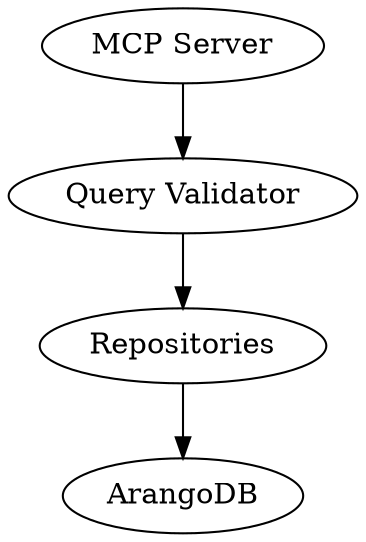
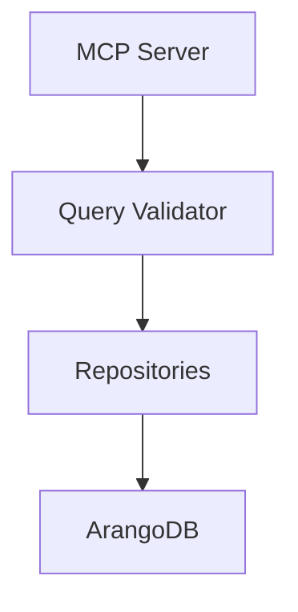
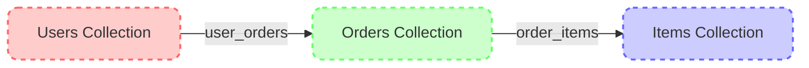
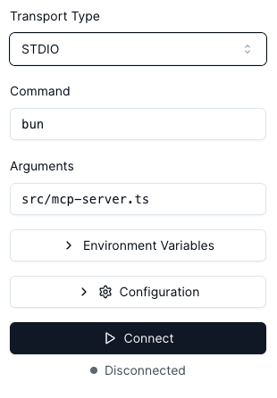
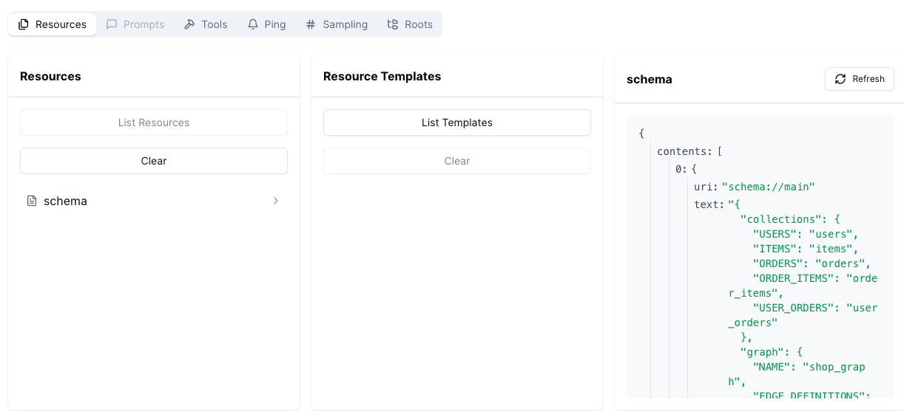
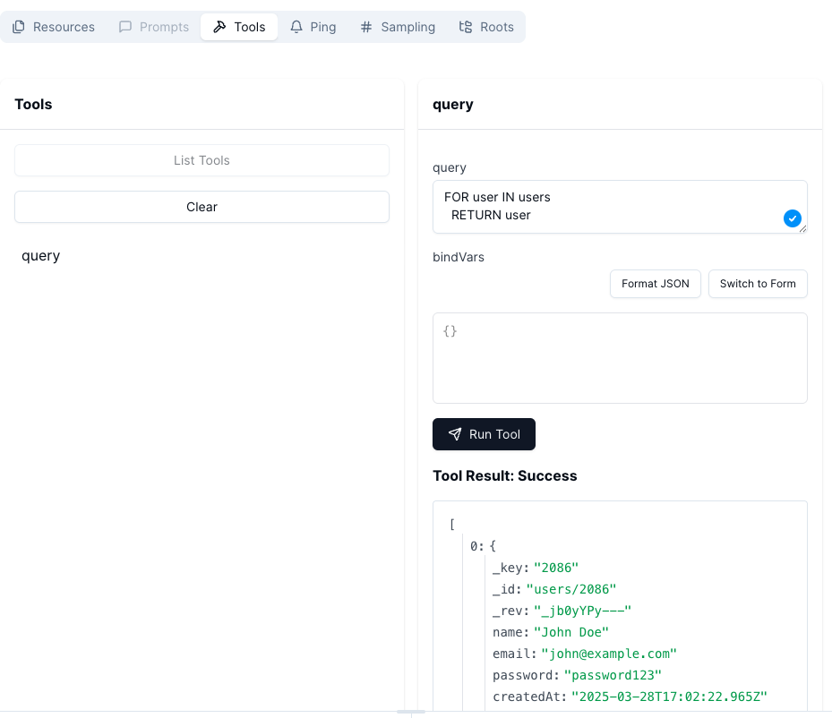

# Enhancing AI Database Interaction with the Model Context Protocol: A Case Study with ArangoDB

Anthropic recently dropped a bombshell in the tech world with the Model Context Protocol (MCP).
Think of it as a magical bridge that lets agentic LLMs play nice with software.
Wrap any API in MCP, and voilà, your AI can use it!
It's like giving your AI a magic wand, but with great power comes great responsibility.
Handing over tasks to an LLM is like letting a toddler loose in a candy store—exciting but unpredictable.
Imagine letting an LLM control atomic weapons—sure, it might process info faster than us, but it could also lead to a sci-fi disaster.
A more down-to-earth scenario?
Letting AI access your database to whip up queries or fetch data in a flash.
To keep the LLM from going rogue and deleting or updating data, you could give it a read-only pass.
Sounds clever, right?

Well, not quite.
The LLM still gets the keys to the kingdom, including all that customer info that should stay under wraps.
Especially in the EU, where GDPR is pretty important.

So, I thought about it and made a solution: an MCP Layer for database access that's GDPR-friendly.
To get this done, I have implemented a LLM validator, thanks to LangChain.

In this tutorial, I'll walk you through the process, step by step.
As a result, we will have an MCP layer for an Arango Database that lets any LLM Agent access at the database schema and run queries, but with a strict "no peeking at user data" rule.
We'll wrap things up by testing it with the MCP Inspector tool and a cloud desktop.
Ready to dive in?

Check out the full scoop on this GitHub page: http://will-come-soon.com

# Discover the Model Context Protocol

The Model Context Protocol (MCP) is your AI's gateway to a world of data and tools. Think of it as a universal connector, like a USB-C port for AI, that standardizes connections, making it easy for AI models to access diverse data sources and services. This protocol simplifies the integration process, allowing AI systems to interact with various data environments seamlessly.

## Key Benefits

- **Seamless Integrations**: Access a library of pre-built connections for streamlined workflows, reducing the complexity of integrating new data sources.
- **Flexibility**: Easily switch between different LLM providers, giving you the freedom to choose the best fit for your needs without being locked into a single ecosystem.
- **Security**: Built-in best practices to protect your data, ensuring that sensitive information remains secure and compliant with regulations like GDPR.

## Architecture Overview

MCP employs a client-server model to facilitate communication between AI systems and data sources:

- **MCP Hosts**: Applications running an AI Agent like Claude that seek data access, acting as the interface for users or other systems.
- **MCP Clients**: Maintain direct connections to servers, handling the communication and data exchange.
- **MCP Servers**: Expose capabilities via the protocol, providing access to the underlying data and services.
- **Data Sources**: Local and remote systems that are accessible by servers, including databases, APIs, and more.

Here's a visual representation of the architecture:



Explore more at the [Model Context Protocol Introduction](https://modelcontextprotocol.io/introduction).


## The ArangoDB MCP Implementation

This implementation creates a bridge between AI systems and an ArangoDB database that stores e-commerce data using a graph model. 
The database contains collections for users, items, and orders, with relationships modeled through edge collections. 

### Project Architecture

The architecture follows a clean, layered design pattern:



Key components include:
- MCP server implementation using the official MCP SDK
- Repository pattern for database access
- Query validation using OpenAI LLMs
- ArangoDB connection management

The implementation is built with TypeScript and runs on Bun runtime.

## Step-by-Step Implementation Tutorial

Let's build this MCP server for ArangoDB from scratch, focusing on the essential components.

### Step 1: Setting Up Dependencies

First, create a new project directory and initialize it:

```bash
mkdir mcp-arango-server
cd mcp-arango-server
pnpm init
```

Install the required dependencies:

```bash
pnpm add @modelcontextprotocol/sdk arangojs dotenv zod @langchain/core @langchain/openai langchain

pnpm add -D typescript @types/node eslint @typescript-eslint/eslint-plugin @typescript-eslint/parser
```

In this step, we're installing several crucial packages:
- `@modelcontextprotocol/sdk`: The official SDK for implementing MCP servers, providing the core functionality for resources and tools
- `arangojs`: The official ArangoDB JavaScript driver that allows us to connect to and query the database
- `dotenv`: For loading environment variables from a .env file, keeping sensitive information like API keys secure
- `zod`: A TypeScript-first schema validation library that we'll use to validate tool parameters
- `@langchain/core` and `@langchain/openai`: Components of the LangChain framework that simplify interactions with LLMs
- `langchain`: The main LangChain package for building LLM-powered applications
- Development dependencies include TypeScript and ESLint for code quality and static typing

We're using pnpm as our package manager for its efficiency and disk space savings, but you could also use npm or yarn.

### Step 2: Configure TypeScript

Create a `tsconfig.json` file in the root directory:

```json
{
  "compilerOptions": {
    "target": "ES2022",
    "module": "NodeNext",
    "moduleResolution": "NodeNext",
    "esModuleInterop": true,
    "strict": true,
    "outDir": "dist",
    "forceConsistentCasingInFileNames": true,
    "skipLibCheck": true
  },
  "include": ["src/**/*"],
  "exclude": ["node_modules"]
}
```

This TypeScript configuration sets up our development environment with several important features, but I think there is no further explanaitin needed

### Step 3: Set Up ArangoDB with Docker Compose

To have a full test database, we can simply create it with a `docker-compose.yml` file:

```yaml
version: '3'
services:
  arangodb:
    image: arangodb:latest
    ports:
      - 8530:8529
    environment:
      - ARANGO_ROOT_PASSWORD=rootpassword
    volumes:
      - arangodb_data:/var/lib/arangodb3
      - arangodb_apps:/var/lib/arangodb3-apps

volumes:
  arangodb_data:
  arangodb_apps:
```

Start the ArangoDB container:

```bash
docker-compose up -d
```

### Step 4: Create Environment Variables

Create a `.env` file in the root directory, with variables we will need in the next steps:

```
ARANGO_URL=http://localhost:8530
ARANGO_DB_NAME=shop_db
ARANGO_USERNAME=root
ARANGO_PASSWORD=rootpassword
OPENAI_API_KEY=your_openai_api_key_here
OPENAI_MODEL=gpt-4o
PORT=3000
NODE_ENV=development
```

The `OPENAI_API_KEY` will be needed for the LLM-Validator and needs some credit on your openAi account. However, since we are using langchain to access the LLM, this can be replaced, or even a local LLM or SLM can be used.

### Step 5: Accessing Arango

To access the arango database we firstly have to initialize the schema, the database, then add some data and afterwards we can access the db. 
You can checkout all steps in the GitHub repo, I will now only show you, how to get a connection to the db and querying it. 
It is as simple as that.

```typescript

const getDb = (databaseName?: string): Database => {
  if (!dbInstance) {
    dbInstance = new Database({
c      url: process.env.ARANGO_URL,
      auth: {
        username: process.env.ARANGO_USERNAME,
        password: process.env.ARANGO_PASSWORD
      },
      databaseName: databaseName || process.env.ARANGO_DB_NAME
    });
    console.log(`Connected to ArangoDB at ${process.env.ARANGO_URL}, database: ${process.env.ARANGO_DB_NAME}`);
  }
  return dbInstance;
};


export const executeQuery = async <T>(query: string, params: Record<string, any> = {}): Promise<T[]> => {
  const db = getDb();
  const cursor = await db.query(query, params);
  return await cursor.all() as T[];
}
```

After all, I have implemented three collections, which are linked like that 



### Step 6: Implement the MCP Server

The MCP server is a crucial component that provides standardized access to our ArangoDB database. In our case, the MCP server is started by the MCP Host, which will be the claud desktop app. 

In our exmample I have added two endpoints, which are availbe for the LLM. One provdides the structure of the database, which is a static not changing thing. Therefore we are using the MCP Type `resource` which are read-only data providers. The second endpoint is the query endpoint, which is dynamic and acts like a function call. Therefore it defined as the MCP type `tools`, which is similar to the tools provided to normal AI agents. 

With the help of `zod`, we can define typed input parameters with an additional description, so the LLM knows how to interact with the endpoints.

Client communication with the server is facilitated using the `StdioServerTransport`, which utilizes standard input/output streams for message exchange. This setup is ideal for local integration, but for production, HTTP or WebSocket transports might be used.

```typescript
// Load environment variables
import 'dotenv/config';

import { McpServer } from '@modelcontextprotocol/sdk/server/mcp.js';
import { StdioServerTransport } from '@modelcontextprotocol/sdk/server/stdio.js';
import { z } from 'zod';
import { QueryRepository } from './repositories/QueryRepository.js';
import { COLLECTIONS, GRAPH, INDEXES } from './schemas/schema.js';

// Get the NODE_ENV from environment or default to development
const NODE_ENV = process.env.NODE_ENV || 'development';
console.log(`Starting MCP server in ${NODE_ENV} mode`);

const queryRepo = new QueryRepository();

// Create the MCP server
const server = new McpServer({
  name: 'arango-db-server',
  version: '1.0.0',
  description: 'Server for querying ArangoDB and getting schema information'
});

// Schema resource - provides information about the ArangoDB schema
server.resource(
  'schema',
  'schema://main',
  async () => ({
    contents: [{
      uri: 'schema://main',
      text: JSON.stringify({
        collections: COLLECTIONS,
        graph: GRAPH,
        indexes: INDEXES
      }, null, 2)
    }]
  })
);

// Query tool - simple implementation without validation for now
server.tool(
  'query',
  {
    query: z.string().describe('AQL query to execute against the database'),
    bindVars: z.record(z.any()).optional().describe('Bind variables to use in the parameterized query'),
  },
  async ({ query, bindVars = {} }) => {
    try {
      // Execute the query
      const results = await queryRepo.executeQuery(query, bindVars);
      return {
        content: [{
          type: 'text',
          text: JSON.stringify(results, null, 2)
        }]
      };
    } catch (error: unknown) {
      const errorMessage = error instanceof Error ? error.message : String(error);
      return {
        content: [{
          type: 'text',
          text: `Error executing query: ${errorMessage}`
        }],
        isError: true
      };
    }
  }
);

// Start the server using stdio transport
const transport = new StdioServerTransport();
server.listen(transport);
console.log('MCP server running, waiting for commands...');
```


Update the `package.json` scripts section:

```json
"scripts": {
  "start": "bun src/mcp-server.ts",
  "inspector": "npx @modelcontextprotocol/inspector bun src/mcp-server.ts"
}
```

These script definitions make it easy to run common tasks:
- `start`: Starts the MCP server using Bun runtime - Just for testing, if it will compile
- `inspector`: Runs the MCP Inspector to test our server interactively
- Bun's TypeScript support allows us to run .ts files directly without a separate compilation step

### Step 10: Testing with MCP Inspector

Now let's test the MCP server using the MCP Inspector by executing the inspector script

```bash
pnpm run inspector
```

The MCP Inspector is an invaluable tool for testing and debugging your MCP server. It provides a simple UI, where you can fully interact with the MCP server, like executing the tools or getting the resource.

After accessing the the Web UI, we can see on the left panel some prefilled are to connect with the mcp server. This got prefilled by our 

 

**MCP Inspector Settings**

1. **Transport Type**: This setting determines how the MCP Inspector communicates with your server. We use `STDIO`, which uses standard input/output streams for communication. This is ideal for local testing. Alternatively SSE with HTTP can be used

2. **Command**: This is the command used to start your MCP server. The app will be started with `bun`. If node is used, this should be replaced with `node`, as an example

3. **Arguments**: These are the additional parameters passed to the command. Bun needs the file to execute as parameters, therefore set the root file as argument `src/mcp-server.ts`.

After clicking on connect, we can see the available resources and tools, which is the same, our future agent will see and access. 
Clicking on the reesources, we can access the schema.

 

Clicking on the tab Tools, will get us the query tool. I have added some test data to the database and execute some simple query, to fetch all users. As we can see in the screenshot, the MCP server will then get us the response for the query 

 


### Step 11: Add LLM Query Validation

Now, let's add the LLM validation to protect against destructive queries.


The query validator introduces an innovative security layer using AI to protect our database:

1. **LLM-Based Security Approach**:
   - Rather than using regex patterns or keyword matching, we leverage an LLM's understanding of database operations
   - This approach is more flexible and can handle complex queries that might bypass simpler validation techniques
   - The LLM can provide reasoning about why a query is considered destructive

2. **LangChain Integration**:
   - We use LangChain to streamline the interaction with OpenAI's models
   - The `ChatOpenAI` class handles the communication with the OpenAI API
   - Setting `temperature: 0` ensures more deterministic responses, which is important for validation

3. **Prompt Engineering**:
   - The prompt is carefully crafted to guide the LLM's analysis
   - It explicitly defines what constitutes a destructive query (INSERT, UPDATE, DELETE, etc.)
   - It provides context about AQL-specific operations
   - Clear instructions help ensure consistent validation results

4. **Structured Output**:
   - We use LangChain's structured output feature with Zod schema validation
   - This ensures the LLM response follows our expected format with `isDestructive` and `reason` fields
   - Structured output is more reliable than parsing free-form text responses

5. **Error Handling**:
   - We check for the required OpenAI API key upfront
   - Errors in the validation process are caught and transformed into meaningful messages
   - The system fails gracefully if the validation cannot be performed

This validator acts as a gatekeeper, preventing accidental or intentional destructive operations against the database. It's especially important when providing database access to AI models, as they might generate queries that modify data without understanding the implications.


```typescript
import { ChatOpenAI } from '@langchain/openai';
import { PromptTemplate } from "@langchain/core/prompts";
import { z } from 'zod';
import 'dotenv/config';

// Load environment variables
const OPENAI_API_KEY = process.env.OPENAI_API_KEY;
const OPENAI_MODEL = process.env.OPENAI_MODEL || 'gpt-4o';

/**
 * Determines if a query is destructive (INSERT, UPDATE, DELETE, REMOVE operations)
 * using OpenAI LLM for validation
 */
export async function isDestructiveQuery(query: string): Promise<{
  isDestructive: boolean;
  reason: string;
}> {
  try {
    // Check for OpenAI API key
    if (!OPENAI_API_KEY) {
      throw new Error('OPENAI_API_KEY environment variable is required for query validation');
    }
    
    // Initialize the OpenAI model
    const model = new ChatOpenAI({
      modelName: OPENAI_MODEL,
      temperature: 0,
      openAIApiKey: OPENAI_API_KEY,
    });
    
    // Create prompt template for validation
    const promptTemplate = new PromptTemplate({
      template: `
You are a database security expert tasked with evaluating ArangoDB AQL queries to determine 
if they are destructive (modifying data) or non-destructive (read-only).

Please analyze the following AQL query and determine if it is destructive. A destructive 
query will INSERT, UPDATE, REPLACE, DELETE, REMOVE, CREATE, DROP, or otherwise modify data 
or schema. A non-destructive query will only READ data (RETURN, FOR, FILTER, SORT, LIMIT, etc.).

Query: {query}

`,
      inputVariables: ["query"],
    });

    // Generate the prompt
    const prompt = await promptTemplate.format({ query });
    
    const responseSchema = z.object({
      isDestructive: z.boolean(),
      reason: z.string(),
    });
    const structuredModel = model.withStructuredOutput(responseSchema);
    
    // Get the LLM response
    const response = await structuredModel.invoke(prompt);
    
    return {
      isDestructive: response.isDestructive,
      reason: response.reason || 'No reason provided'
    };
  } catch (error) {
    console.error('Query validation error:', error);
    throw new Error(`Query validation failed: ${error instanceof Error ? error.message : String(error)}`);
  }
}
```

### Step 12: Update MCP Server with Query Validation

Modify the `src/mcp-server.ts` file to include the query validation:

```typescript
// Load environment variables
import 'dotenv/config';

import { McpServer } from '@modelcontextprotocol/sdk/server/mcp.js';
import { StdioServerTransport } from '@modelcontextprotocol/sdk/server/stdio.js';
import { z } from 'zod';
import { QueryRepository } from './repositories/QueryRepository.js';
import { COLLECTIONS, GRAPH, INDEXES } from './schemas/schema.js';
import { isDestructiveQuery } from './services/queryValidator.js';

// Get the NODE_ENV from environment or default to development
const NODE_ENV = process.env.NODE_ENV || 'development';
console.log(`Starting MCP server in ${NODE_ENV} mode`);

const queryRepo = new QueryRepository();

// Create the MCP server
const server = new McpServer({
  name: 'arango-db-server',
  version: '1.0.0',
  description: 'Server for querying ArangoDB and getting schema information'
});

// Schema resource - provides information about the ArangoDB schema
server.resource(
  'schema',
  'schema://main',
  async () => ({
    contents: [{
      uri: 'schema://main',
      text: JSON.stringify({
        collections: COLLECTIONS,
        graph: GRAPH,
        indexes: INDEXES
      }, null, 2)
    }]
  })
);

// Query tool - now with LLM validation
server.tool(
  'query',
  {
    query: z.string().describe('AQL query to execute against the database'),
    bindVars: z.record(z.any()).optional().describe('Bind variables to use in the parameterized query'),
    skipValidation: z.boolean().optional().describe('Skip LLM validation for destructive queries (use with caution)')
  },
  async ({ query, bindVars = {}, skipValidation = false }) => {
    try {
      // Check if the query is destructive using LLM validation
      if (!skipValidation) {
        try {
          const validation = await isDestructiveQuery(query);
          
          // If the query is destructive, return an error
          if (validation.isDestructive) {
            return {
              content: [{
                type: 'text',
                text: `Query validation failed: This query appears to be destructive. ${validation.reason}
                
To execute this query anyway, set skipValidation: true`
              }],
              isError: true
            };
          }
        } catch (validationError) {
          // If validation fails (e.g., no API key), warn but allow query to proceed
          console.warn('Query validation skipped:', validationError instanceof Error ? validationError.message : String(validationError));
        }
      }
      
      // Execute the query
      const results = await queryRepo.executeQuery(query, bindVars);
      return {
        content: [{
          type: 'text',
          text: JSON.stringify(results, null, 2)
        }]
      };
    } catch (error: unknown) {
      const errorMessage = error instanceof Error ? error.message : String(error);
      return {
        content: [{
          type: 'text',
          text: `Error executing query: ${errorMessage}`
        }],
        isError: true
      };
    }
  }
);

// Start the server using stdio transport
const transport = new StdioServerTransport();
server.listen(transport);
console.log('MCP server running, waiting for commands...');
```

This updated MCP server incorporates our query validation for enhanced security:

1. **New Parameter for Override**:
   - We've added a `skipValidation` parameter to the query tool's schema
   - This boolean parameter is optional and defaults to false
   - It allows trusted users to bypass validation when necessary
   - The parameter description clearly warns about using this option with caution

2. **Integration with Validator**:
   - We import the `isDestructiveQuery` function from our validator service
   - The validation is performed before executing any query (unless explicitly skipped)
   - This creates a security checkpoint that prevents accidental data modifications

3. **Graceful Validation Failures**:
   - If validation fails for technical reasons (e.g., missing API key), we log a warning but allow the query to proceed
   - This prevents the system from becoming completely non-functional if the validator has issues
   - In a production system, you might want stricter behavior, blocking all queries if validation is unavailable

4. **Clear Error Messages**:
   - When a destructive query is detected, we return a detailed error message
   - The message includes the reason provided by the LLM for why the query is considered destructive
   - We also provide instructions on how to bypass validation if needed
   - This helps users understand the security measure and how to work with it

5. **Standard MCP Error Formatting**:
   - We return errors in the standard MCP format with `isError: true`
   - The error content is provided as text in the response
   - This consistent error handling makes it easier for clients to process and display errors

The updated implementation provides a robust security layer while maintaining flexibility for legitimate use cases. By default, it prevents any data modifications, but authorized users can still perform necessary operations by explicitly setting `skipValidation: true`.

### Step 13: Test with Query Validation

Now when you run the MCP Inspector:

```bash
pnpm run inspector
```

Try both types of queries:

1. Non-destructive (should work):
```
FOR user IN users RETURN user
```

2. Destructive (should be blocked):
```
INSERT { name: "New User", email: "test@example.com" } INTO users
```

3. Destructive with validation bypass (should work):
```